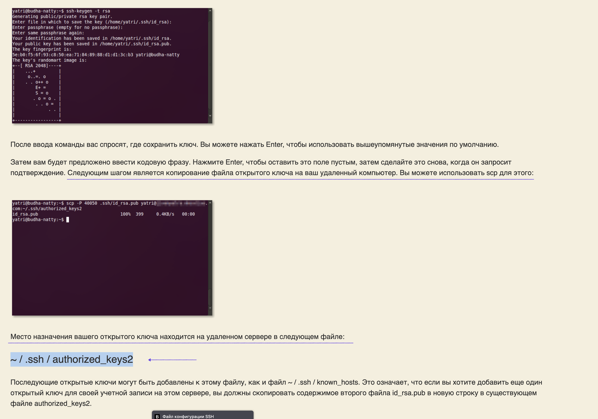
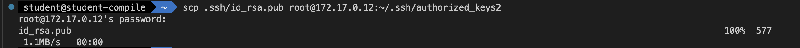

## Part_5
### копирование файлов по ссш
### копируем публичный ключ (если нет то генерируем) в `~/.ssh/authorized_keys2` на второй ммашине

### -->

### Директивы правил и ограничений
#### Для управления поведением выполнения задач могут использоваться директивы с правилами и условиями. Подробнее мы их рассмотрим ниже, а в данном разделе просто перечислим их.

`Rules
https://docs.gitlab.com/ee/ci/yaml/#rules.`

#### Правила, при соблюдении которых наше задание может быть запущено. Примеры работы с директивой rules приведены ниже.

`When
https://docs.gitlab.com/ee/ci/yaml/#when.`

#### Определяет условия запуска задания, например, только ручной запуск или через определенный интервал времени. Примеры работы приведены ниже.

`Needs
https://docs.gitlab.com/ee/ci/yaml/#needs.`

#### Тоже набор правил, требующий определенных условий для запуска задачи.